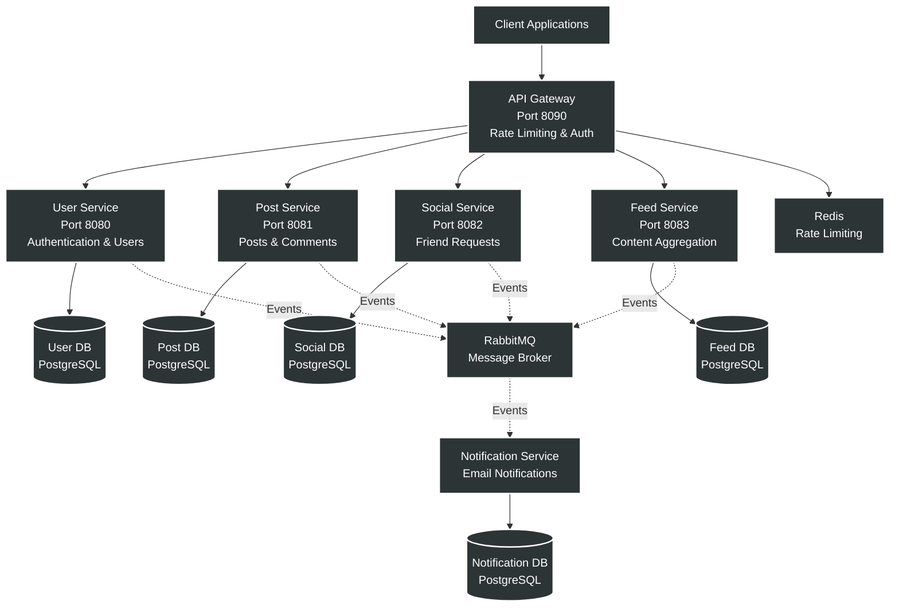
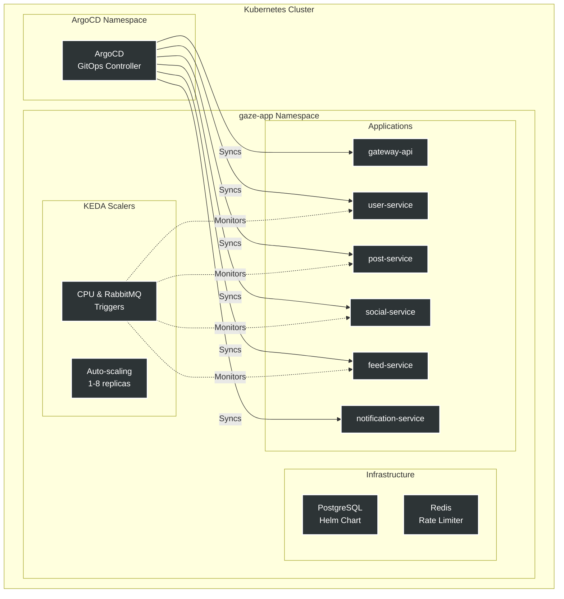
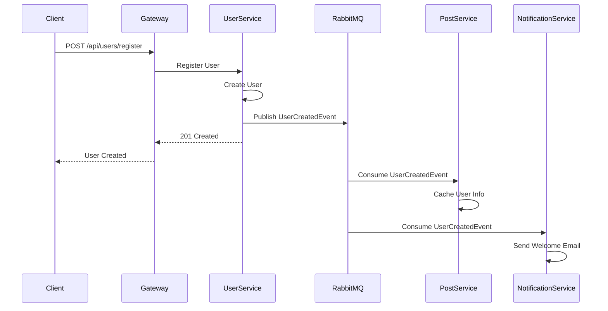

# Gaze-App - Social Media Microservices Platform

## 📋 Overview

Gaze-App is a cloud-native social media platform built using microservices architecture, designed for scalability and resilience. The platform implements event-driven patterns with asynchronous communication and follows modern DevOps practices with GitOps deployment using ArgoCD. [1](#0-0) 

## 🏗️ Architecture Overview



## 🚀 Technology Stack

### Core Technologies
- **Language**: Java 21
- **Framework**: Spring Boot 3.2.1
- **Spring Cloud**: 2023.0.0
- **Build Tool**: Maven (Multi-module) [3](#0-2) 

### Infrastructure
- **Container Orchestration**: Kubernetes
- **GitOps**: ArgoCD
- **Autoscaling**: KEDA (Kubernetes Event-Driven Autoscaling)
- **Message Broker**: RabbitMQ
- **Cache/Rate Limiting**: Redis
- **Databases**: PostgreSQL 16 (one per service) [4](#0-3) 

### Security & Authentication
- **Authentication**: JWT (JSON Web Tokens)
- **Security Framework**: Spring Security with OAuth2 Resource Server [5](#0-4) 

## 📁 Repository Structure

```
Gaze-app/
├── api-gateway/              # API Gateway service
├── services/
│   ├── user-service/        # User authentication & management
│   ├── post-service/        # Posts, comments & likes
│   ├── social-service/      # Friend requests & relationships
│   ├── feed-service/        # Content feed aggregation
│   └── notification-service/ # Email notifications
├── common-events/           # Shared event definitions
├── common-security/         # Shared security configurations
├── infra/
│   ├── compose.yaml        # Docker Compose for local dev
│   └── k8s/
│       ├── apps/           # Service deployments
│       ├── argocd/         # ArgoCD configurations
│       └── infra-components/ # Infrastructure (Postgres, Redis)
└── pom.xml                  # Root Maven POM
```

## 🎯 Microservices

### API Gateway
Entry point for all client requests with:
- Intelligent routing to backend services
- JWT-based authentication
- Redis-powered rate limiting
- Circuit breaker patterns [6](#0-5) 

### User Service
Handles user authentication and management:
- User registration and login
- JWT token generation and validation
- User profile management
- Publishes user events to RabbitMQ [7](#0-6) 

### Post Service
Manages user-generated content:
- Post creation, editing, and deletion
- Comments and likes management
- Two-phase post creation with async validation
- Content moderation

### Social Service
Handles social relationships:
- Friend request management
- Friendship status tracking
- Social graph operations

### Feed Service
Aggregates personalized content:
- User feed generation
- Content ranking and filtering
- Real-time feed updates via events

### Notification Service
Event-driven notification system:
- Email notifications
- Event consumption from RabbitMQ
- No REST API exposure [8](#0-7) 

## ☸️ Kubernetes Architecture



### ArgoCD Configuration
All services are managed through ArgoCD ApplicationSet for automated GitOps deployment: [9](#0-8) 

### KEDA Autoscaling
Services implement event-driven autoscaling based on:
- **CPU utilization**: Scales at 80% CPU usage
- **RabbitMQ queue length**: Scales based on message backlog
- **Replica range**: 1-8 pods per service
- **Fallback mode**: 2 replicas on metric failure [10](#0-9) 

### Resource Management
Each service deployment includes:
- **CPU requests**: 250m (0.25 cores)
- **CPU limits**: 500m (0.5 cores)
- **Memory requests**: 256Mi
- **Memory limits**: 512Mi
- **Connection pooling**: 5 connections per service [11](#0-10) 

## 🔄 Communication Patterns



## 🛠️ Development Setup

### Prerequisites
- Java 21
- Maven 3.8+
- Docker & Docker Compose
- Kubernetes cluster (local or cloud)
- kubectl CLI
- ArgoCD CLI (optional)

### Local Development with Docker Compose

1. **Start Infrastructure Services**:
```bash
cd infra
docker-compose up -d
```

This starts:
- RabbitMQ (ports 5672, 15672)
- Redis (port 6379)
- 5 PostgreSQL databases (ports 5433-5437) [12](#0-11) 

2. **Build All Services**:
```bash
mvn clean install
```

3. **Run Individual Services**:
```bash
# User Service
cd services/user-service
mvn spring-boot:run

# API Gateway
cd api-gateway
mvn spring-boot:run
```

### Kubernetes Deployment

1. **Apply ArgoCD Applications**:
```bash
kubectl apply -f infra/k8s/argocd/apps/argocd-apps.yaml
kubectl apply -f infra/k8s/argocd/apps/argocd-infra-apps.yaml
```

2. **Verify Deployments**:
```bash
kubectl get applications -n argocd
kubectl get pods -n gaze-app
```

3. **Access Services**:
```bash
# Port forward API Gateway
kubectl port-forward -n gaze-app svc/gateway-api 8090:8090
```

## 🗄️ Database Architecture

Each microservice follows the database-per-service pattern with dedicated PostgreSQL instances: [13](#0-12) 

### Database Initialization
- **Init Scripts**: Managed via Kubernetes secrets
- **Persistence**: 4Gi per database
- **Architecture**: Standalone (single node)
- **Health Checks**: Startup, liveness, and readiness probes configured

## 🔐 Security

### JWT Authentication
- Private/Public key pair for token signing
- Keys mounted as Kubernetes secrets
- Token validation at API Gateway and services [14](#0-13) 

### Secrets Management
- Database credentials stored in Kubernetes secrets
- RabbitMQ credentials secured
- JWT keys mounted as volumes [15](#0-14) 

## 📊 Monitoring & Observability

### Health Checks
All services expose Spring Boot Actuator endpoints:
- `/actuator/health`
- `/actuator/info`
- `/actuator/metrics`

### Autoscaling Metrics
KEDA monitors:
- CPU utilization
- RabbitMQ queue depths
- Custom application metrics [16](#0-15) 

## 🚦 API Documentation

Each service exposes OpenAPI/Swagger documentation:
- **User Service**: `http://localhost:8080/swagger-ui.html`
- **Post Service**: `http://localhost:8081/swagger-ui.html`
- **Social Service**: `http://localhost:8082/swagger-ui.html`
- **Feed Service**: `http://localhost:8083/swagger-ui.html`
- **API Gateway**: `http://localhost:8090/swagger-ui.html`

## 🤝 Contributing

### Branch Strategy
- `main`: Production-ready code
- `test`: Testing environment (ArgoCD target)
- Feature branches: `feature/your-feature-name`

### Code Standards
- Java 21 features encouraged
- Lombok for boilerplate reduction
- MapStruct for object mapping
- OpenAPI-first API design

## 📝 Notes

### Design Patterns Implemented
- **Database per Service**: Each microservice has its own database
- **API Gateway Pattern**: Single entry point for clients
- **Event-Driven Architecture**: Async communication via RabbitMQ
- **CQRS**: Separate read/write models in Feed Service
- **Circuit Breaker**: Implemented in API Gateway
- **Rate Limiting**: Redis-based at gateway level

### Deployment Strategy
- **GitOps**: ArgoCD continuously syncs from Git repository
- **Auto-sync**: Automated deployment on code changes
- **Self-healing**: ArgoCD automatically corrects drift
- **Namespace isolation**: All apps in `gaze-app` namespace

### Scalability Features
- **Horizontal Pod Autoscaling**: 1-8 replicas per service
- **Message-driven scaling**: Based on RabbitMQ queue depth
- **Connection pooling**: Optimized database connections (5 per pod)
- **Stateless services**: All services can scale horizontally

---

**Repository**: [Juangmz7/Gaze-app](https://github.com/Juangmz7/Gaze-app)  
**License**: (Add your license information)  
**Maintainer**: Juan Gomez

### Citations

**File:** pom.xml (L7-12)
```text
    <parent>
        <groupId>org.springframework.boot</groupId>
        <artifactId>spring-boot-starter-parent</artifactId>
        <version>3.2.1</version>
        <relativePath/>
    </parent>
```

**File:** pom.xml (L20-29)
```text
    <modules>
        <module>common-events</module>
        <module>services/feed-service</module>
        <module>services/notification-service</module>
        <module>services/post-service</module>
        <module>services/social-service</module>
        <module>services/user-service</module>
        <module>common-security</module>
        <module>api-gateway</module>
    </modules>
```

**File:** pom.xml (L31-37)
```text
    <properties>
        <java.version>21</java.version>
        <maven.compiler.source>21</maven.compiler.source>
        <maven.compiler.target>21</maven.compiler.target>
        <project.build.sourceEncoding>UTF-8</project.build.sourceEncoding>
        <spring-cloud.version>2023.0.0</spring-cloud.version>
    </properties>
```

**File:** infra/compose.yaml (L1-106)
```yaml
services:
  rabbitmq:
    image: rabbitmq:management
    restart: "no"
    ports:
      - "5672:5672"       # Port where applications connect
      - "15672:15672"     # Port for management interface

  redis:
    image: redis:alpine
    container_name: redis-rate-limiter
    ports:
      - "6379:6379"
    restart: always
    healthcheck:
      test: [ "CMD", "redis-cli", "ping" ]
      interval: 10s
      timeout: 5s
      retries: 3

  # --- User Service Database ---
  user-db:
    image: postgres:16-alpine
    container_name: user-db
    ports:
      - "5437:5432" # Host Port : Container Port
    environment:
      POSTGRES_USER: admin
      POSTGRES_PASSWORD: password123
      POSTGRES_DB: user-db
    volumes:
      - user_postgres_data:/var/lib/postgresql/data
    networks:
      - social-network

  # --- Post Service Database ---
  post-db:
    image: postgres:16-alpine
    container_name: post-db
    ports:
      - "5435:5432" # Maps host 5433 to container 5432
    environment:
      POSTGRES_USER: admin
      POSTGRES_PASSWORD: password123
      POSTGRES_DB: post-db
    volumes:
      - post_postgres_data:/var/lib/postgresql/data
    networks:
      - social-network

  # --- Feed Service Database ---
  feed-db:
    image: postgres:16-alpine
    container_name: feed-db
    ports:
      - "5433:5432" # Maps host 5434 to container 5432
    environment:
      POSTGRES_USER: admin
      POSTGRES_PASSWORD: password123
      POSTGRES_DB: feed-db
    volumes:
      - feed_postgres_data:/var/lib/postgresql/data
    networks:
      - social-network

  # --- Social Service Database ---
  social-db:
    image: postgres:16-alpine
    container_name: social-db
    ports:
      - "5436:5432" # Maps host 5434 to container 5432
    environment:
      POSTGRES_USER: admin
      POSTGRES_PASSWORD: password123
      POSTGRES_DB: social-db
    volumes:
      - social_postgres_data:/var/lib/postgresql/data
    networks:
      - social-network

  # --- Notification Service Database ---
  notification-db:
    image: postgres:16-alpine
    container_name: notification-db
    ports:
      - "5434:5432" # Maps host 5434 to container 5432
    environment:
      POSTGRES_USER: admin
      POSTGRES_PASSWORD: password123
      POSTGRES_DB: notification-db
    volumes:
      - notification_postgres_data:/var/lib/postgresql/data
    networks:
      - social-network


volumes:
  user_postgres_data:
  post_postgres_data:
  feed_postgres_data:
  social_postgres_data:
  notification_postgres_data:

networks:
  social-network:
    driver: bridge
```

**File:** common-security/pom.xml (L20-34)
```text
    <dependencies>
        <dependency>
            <groupId>org.springframework.boot</groupId>
            <artifactId>spring-boot-starter-security</artifactId>
        </dependency>

        <dependency>
            <groupId>org.springframework.boot</groupId>
            <artifactId>spring-boot-starter-web</artifactId>
        </dependency>

        <dependency>
            <groupId>org.springframework.boot</groupId>
            <artifactId>spring-boot-starter-oauth2-resource-server</artifactId>
        </dependency>
```

**File:** infra/k8s/apps/gateway-api/00-deployment.yaml (L48-76)
```yaml
            - name: USER_SVC_URL
              valueFrom:
                configMapKeyRef:
                  name: gateway-config
                  key: USER_SVC_URL

            - name: SOCIAL_SVC_URL
              valueFrom:
                configMapKeyRef:
                  name: gateway-config
                  key: SOCIAL_SVC_URL

            - name: POST_SVC_URL
              valueFrom:
                configMapKeyRef:
                  name: gateway-config
                  key: POST_SVC_URL

            - name: FEED_SVC_URL
              valueFrom:
                configMapKeyRef:
                  name: gateway-config
                  key: FEED_SVC_URL

            - name: SPRING_SECURITY_OAUTH2_RESOURCESERVER_JWT_JWK_SET_URI
              valueFrom:
                configMapKeyRef:
                  name: gateway-config
                  key: JWK_SET_URI
```

**File:** infra/k8s/apps/user-service/00-deployment.yaml (L30-41)
```yaml
          resources:
            requests:
              cpu: "250m"
              memory: "256Mi"
            limits:
              cpu: "500m"
              memory: "512Mi"

          # --- App configuration ---
          env:
            - name: SPRING_DATASOURCE_HIKARI_MAXIMUM_POOL_SIZE
              value: "5"
```

**File:** infra/k8s/apps/user-service/00-deployment.yaml (L81-97)
```yaml
            - name: SPRING_DATASOURCE_PASSWORD
              valueFrom:
                secretKeyRef:
                  name: user-secrets
                  key: user-db-password

            - name: SPRING_RABBITMQ_HOST
              valueFrom:
                configMapKeyRef:
                  name: user-config
                  key: INFRA_RABBIT_HOST

            - name: SPRING_RABBITMQ_PASSWORD
              valueFrom:
                secretKeyRef:
                  name: user-secrets
                  key: rabbitmq-password
```

**File:** infra/k8s/apps/user-service/00-deployment.yaml (L105-115)
```yaml
            - name: JWT_KEYS_PRIVATE_PATH
              valueFrom:
                configMapKeyRef:
                  name: user-config
                  key: JWT_PRIVATE_KEY_PATH

            - name: JWT_KEYS_PUBLIC_PATH
              valueFrom:
                configMapKeyRef:
                  name: user-config
                  key: JWT_PUBLIC_KEY_PATH
```

**File:** infra/k8s/apps/user-service/00-deployment.yaml (L117-123)
```yaml
      volumes:
        - name: secret-volume
          secret:
            secretName: jwt-keys
        - name: public-key-volume
          secret:
            secretName: jwt-public-key
```

**File:** infra/k8s/argocd/apps/argocd-apps.yaml (L1-48)
```yaml
apiVersion: argoproj.io/v1alpha1
kind: ApplicationSet
metadata:
  name: gaze-application-set
  namespace: argocd
spec:
  generators:
    - list:
        elements:
          - name: feed-service
            path: infra/k8s/apps/feed-service

          - name: post-service
            path: infra/k8s/apps/post-service

          - name: gateway-service
            path: infra/k8s/apps/gateway-api

          - name: notification-service
            path: infra/k8s/apps/notification-service

          - name: social-service
            path: infra/k8s/apps/social-service

          - name: user-service
            path: infra/k8s/apps/user-service

  template:
    metadata:
      name: '{{name}}'
      namespace: argocd
    spec:
      project: default
      source:
        repoURL: 'https://github.com/Juangmz7/Gaze-app.git'
        targetRevision: test
        path: '{{path}}'

      destination:
        server: https://kubernetes.default.svc
        namespace: gaze-app

      syncPolicy:
        automated:
          prune: true
          selfHeal: true
        syncOptions:
          - CreateNamespace=true
```

**File:** infra/k8s/apps/user-service/02-scaled-object.yaml (L1-36)
```yaml
apiVersion: keda.sh/v1alpha1
kind: ScaledObject
metadata:
  name: user-service-scaler
  namespace: gaze-app
spec:
  scaleTargetRef:
    name: user-service
  minReplicaCount: 1        # Minimum pods during normal hours
  maxReplicaCount: 8       # Maximum pods under heavy load
  pollingInterval:  15      # Frequency for checking the work load in seconds
  cooldownPeriod:   120
  fallback:
    failureThreshold: 3     #  If Connection fails 3 times then safe mode
    replicas: 2             # Safe mode
  triggers:
    # Workload Scaler
    - type: cpu
      metricType: Utilization
      metadata:
        value: "80"                # Scale up if CPU usage exceeds 50%

      # Scales with queue length
    - type: rabbitmq
      metadata:
        protocol: http

        # Since all queues for this project have been already defined and this is not a prod env,
        # instead of using helm for abstracting variables, we use regex
        queueName: "^.*user-service.*$"
        useRegex: "true"
        mode: QueueLength
        value: "20"
        operation: sum
      authenticationRef:
        name: user-keda-trigger-auth-rabbitmq-conn
```

**File:** infra/k8s/infra-components/postgres/values.yaml (L1-59)
```yaml
postgresql:
  fullnameOverride: "postgres"
  image:
    registry: docker.io
    repository: bitnamilegacy/postgresql
    tag: "15"
  volumePermissions:
    enabled: true
    image:
      registry: docker.io
      repository: bitnamilegacy/os-shell
      tag: "11"
      pullPolicy: IfNotPresent
  global:
    postgresql:
      auth:
        username: postgres      # Superadmin user
        existingSecret: postgres-secrets
        secretKeys:
          adminPasswordKey: postgres-password

  # --- Resource Management ---
  architecture: standalone      # Single node to save resources

  primary:
    persistence:
      size: 4Gi
    resources:
      requests:
        cpu: 400m
        memory: 1Gi

    startupProbe:
      enabled: true
      initialDelaySeconds: 10
      periodSeconds: 10
      timeoutSeconds: 5
      failureThreshold: 30
      successThreshold: 1

    livenessProbe:
      enabled: true
      initialDelaySeconds: 10
      periodSeconds: 10
      timeoutSeconds: 5
      failureThreshold: 5
      successThreshold: 1

    readinessProbe:
      enabled: true
      initialDelaySeconds: 10
      periodSeconds: 10
      timeoutSeconds: 5
      failureThreshold: 5
      successThreshold: 1

    # --- INITIALIZATION SCRIPT ---
    initdb:
      scriptsSecret: postgres-init-db-script
```
