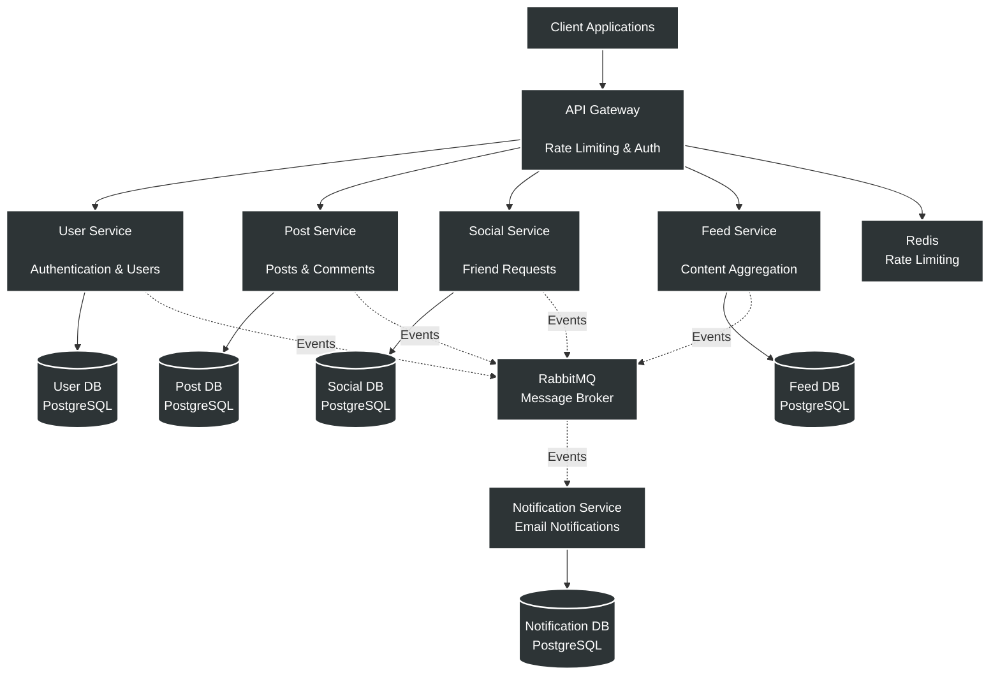
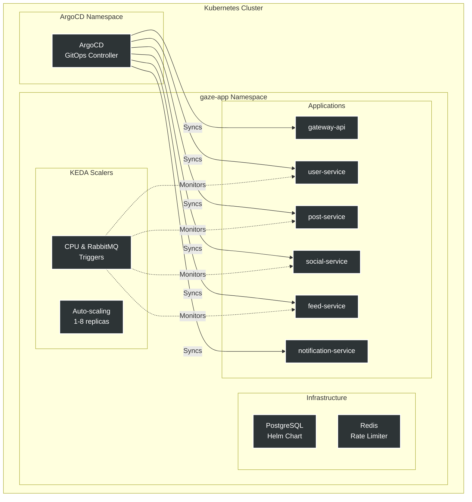
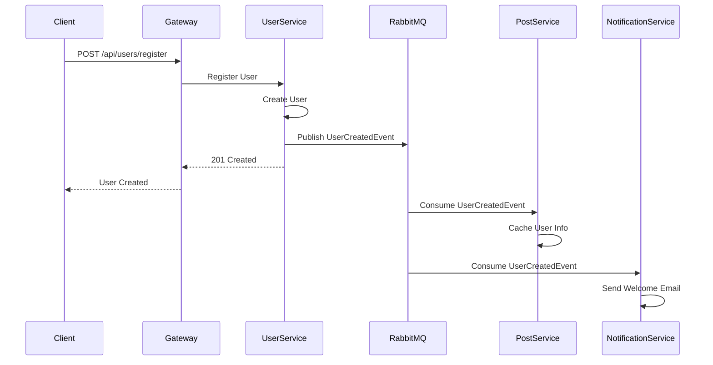

# Gaze-App - Social Media Microservices Platform

## 📋 Overview

Gaze-App is a cloud-native social media platform built using microservices architecture, designed for scalability and resilience. The platform implements event-driven patterns with asynchronous communication and follows modern DevOps practices with GitOps deployment using ArgoCD. 

## 🏗️ Architecture Overview



## 🚀 Technology Stack

### Core Technologies
- **Language**: Java 21
- **Framework**: Spring Boot 3.2.1
- **Spring Cloud**: 2023.0.0
- **Build Tool**: Maven (Multi-module) 

### Infrastructure
- **Container Orchestration**: Kubernetes
- **GitOps**: ArgoCD
- **Autoscaling**: KEDA (Kubernetes Event-Driven Autoscaling)
- **Message Broker**: RabbitMQ
- **Cache/Rate Limiting**: Redis
- **Databases**: PostgreSQL 15 (one per service)

### Security & Authentication
- **Authentication**: JWT (JSON Web Tokens)
- **Security Framework**: Spring Security with OAuth2 Resource Server 

## 📁 Repository Structure

```
Gaze-app/
├── api-gateway/              # API Gateway service
├── services/
│   ├── user-service/        # User authentication & management
│   ├── post-service/        # Posts, comments & likes
│   ├── social-service/      # Friend requests & relationships
│   ├── feed-service/        # Content feed aggregation
│   └── notification-service/ # Email notifications
├── common-events/           # Shared event definitions
├── common-security/         # Shared security configurations
├── infra/
│   ├── compose.yaml        # Docker Compose for local dev
│   └── k8s/
│       ├── apps/           # Service deployments
│       ├── argocd/         # ArgoCD configurations
│       └── infra-components/ # Infrastructure (Postgres, Redis)
└── pom.xml                  # Root Maven POM
```

## 🎯 Microservices

### API Gateway
Entry point for all client requests with:
- Intelligent routing to backend services
- JWT-based authentication
- Redis-powered rate limiting
- Circuit breaker patterns

### User Service
Handles user authentication and management:
- User registration and login
- JWT token generation and validation
- User profile management
- Publishes user events to RabbitMQ

### Post Service
Manages user-generated content:
- Post creation, editing, and deletion
- Comments and likes management
- Two-phase post creation with async validation
- Content moderation

### Social Service
Handles social relationships:
- Friend request management
- Friendship status tracking
- Social graph operations

### Feed Service
Aggregates personalized content:
- User feed generation
- Content ranking and filtering
- Real-time feed updates via events

### Notification Service
Event-driven notification system:
- Email notifications
- Event consumption from RabbitMQ
- No REST API exposure 

## ☸️ Kubernetes Architecture



### ArgoCD Configuration
All services are managed through ArgoCD ApplicationSet for automated GitOps deployment:

### KEDA Autoscaling
Services implement event-driven autoscaling based on:
- **CPU utilization**: Scales at 80% CPU usage
- **RabbitMQ queue length**: Scales based on message backlog
- **Replica range**: 1-8 pods per service
- **Fallback mode**: 2 replicas on metric failure 

### Resource Management
Each service deployment includes:
- **CPU requests**: 250m (0.25 cores)
- **CPU limits**: 500m (0.5 cores)
- **Memory requests**: 256Mi
- **Memory limits**: 512Mi
- **Connection pooling**: 5 connections per service

## 🔄 Communication Patterns



## 🛠️ Development Setup

### Prerequisites
- Java 21
- Maven 3.8+
- Docker & Docker Compose
- Kubernetes cluster (local or cloud)
- kubectl CLI
- ArgoCD CLI (optional)

### Local Development with Docker Compose

1. **Start Infrastructure Services**:
```bash
cd infra
docker compose up -d
```

This starts:
- RabbitMQ (ports 5672, 15672)
- Redis (port 6379)
- 5 PostgreSQL databases (ports 5433-5437)

2. **Build All Services**:
```bash
mvn clean install
```

3. **Run Individual Services**:
```bash
# User Service
cd services/user-service
mvn spring-boot:run

# API Gateway
cd api-gateway
mvn spring-boot:run
```

### Kubernetes Deployment

1. **Apply ArgoCD Applications**:
```bash
kubectl apply -f infra/k8s/argocd/root-app.yaml
```

2. **Verify Deployments**:
```bash
kubectl get applications -n argocd
kubectl get pods -n gaze-app
```

3. **Access Services**:
```bash
# Port forward API Gateway
kubectl port-forward -n gaze-app svc/gateway-api 8090:8090
```

## 🗄️ Database Architecture

Each microservice follows the database-per-service pattern with dedicated PostgreSQL instances:

### Database Initialization
- **Init Scripts**: Managed via Kubernetes secrets
- **Persistence**: 4Gi per database
- **Architecture**: Standalone (single node)
- **Health Checks**: Startup, liveness, and readiness probes configured

## 🔐 Security

### JWT Authentication
- Private/Public key pair for token signing
- Keys mounted as Kubernetes secrets
- Token validation at API Gateway and services 

### Secrets Management
- Database credentials stored in Kubernetes secrets
- RabbitMQ credentials secured
- JWT keys mounted as volumes 

## 📊 Monitoring & Observability

### Autoscaling Metrics
KEDA monitors:
- CPU utilization
- RabbitMQ queue depths
- Custom application metrics  

### Branch Strategy
- `main`: Production-ready code
- `test`: Testing environment (ArgoCD target)
- Feature branches: `feature/your-feature-name`

### Code Standards
- Java 21 features encouraged
- Lombok for boilerplate reduction
- MapStruct for object mapping
- OpenAPI-first API design

## 📝 Notes

### Design Patterns Implemented
- **Database per Service**: Each microservice has its own database
- **API Gateway Pattern**: Single entry point for clients
- **Event-Driven Architecture**: Async communication via RabbitMQ
- **CQRS**: Separate read/write models in Feed Service
- **Circuit Breaker**: Implemented in API Gateway
- **Rate Limiting**: Redis-based at gateway level
- SAGA pattern for distributed transactions

### Deployment Strategy
- **GitOps**: ArgoCD continuously syncs from Git repository
- **Auto-sync**: Automated deployment on code changes
- **Self-healing**: ArgoCD automatically corrects drift
- **Namespace isolation**: All apps in `gaze-app` namespace

### Scalability Features
- **Horizontal Pod Autoscaling**: 1-8 replicas per service
- **Message-driven scaling**: Based on RabbitMQ queue depth
- **Connection pooling**: Optimized database connections (5 per pod)
- **Stateless services**: All services can scale horizontally

---

**Repository**: [Juangmz7/Gaze-app](https://github.com/Juangmz7/Gaze-app)  
**Maintainer**: Juan Gomez
